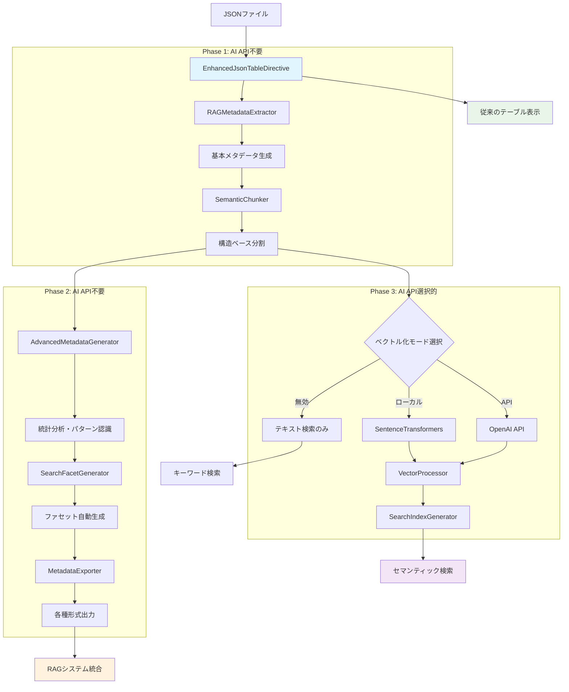
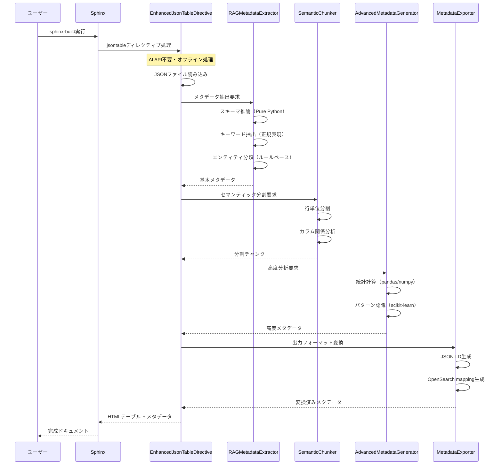
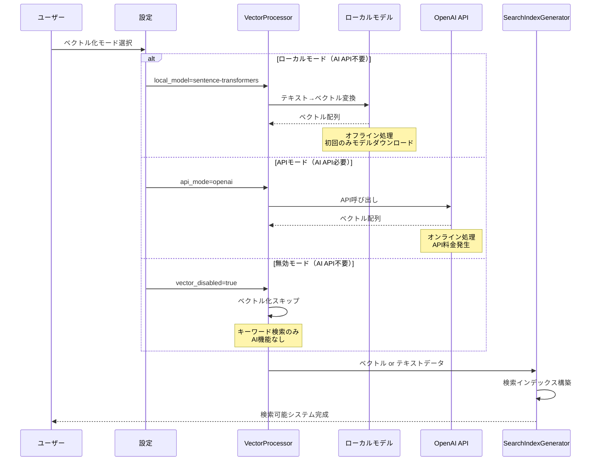

# AI API依存関係とシステムフロー詳細解析

## 重要な結論：段階的AI依存設計

**Phase 1-2は完全にAI API不要**、**Phase 3のみ選択的にAI API使用**という設計になっています。

---

## AI API依存関係マトリクス

| 機能 | AI API必要性 | 代替手段 | 実装優先度 |
|------|-------------|----------|-----------|
| **Phase 1** |  |  |  |
| EnhancedJsonTableDirective | ❌ 不要 | 純粋なPython処理 | 最高 |
| RAGMetadataExtractor | ❌ 不要 | ルールベース + 正規表現 | 最高 |
| SemanticChunker | ❌ 不要 | 構造ベース分割 | 最高 |
| **Phase 2** |  |  |  |
| AdvancedMetadataGenerator | ❌ 不要 | 統計処理 + パターンマッチング | 高 |
| SearchFacetGenerator | ❌ 不要 | データ型推論 + 分布分析 | 高 |
| MetadataExporter | ❌ 不要 | フォーマット変換 | 高 |
| **Phase 3** |  |  |  |
| VectorProcessor | ⚠️ 選択的 | ローカルモデル or API | 中 |
| SearchIndexGenerator | ❌ 不要 | ベクトルDB操作のみ | 中 |

---

## システム全体フロー図



---

## 詳細シーケンス図

### Phase 1-2: AI API不要フロー



### Phase 3: AI API選択的フロー



---

## 具体的な実装例：AI API依存性の詳細

### Phase 1-2: 完全AI API不要の実装

```python
class RAGMetadataExtractor:
    """AI API一切不要のメタデータ抽出"""
    
    def __init__(self):
        # 日本語処理用（オフライン）
        self.jp_patterns = {
            'person_names': r'[一-龯]{2,4}',
            'departments': r'(開発|営業|人事|総務|企画)部?',
            'monetary': r'[0-9,]+円?',
            'dates': r'\d{4}[-/]\d{1,2}[-/]\d{1,2}'
        }
    
    def extract_schema(self, json_data: JsonData) -> dict:
        """Pure Pythonでのスキーマ推論"""
        if isinstance(json_data, list) and json_data:
            sample = json_data[0]
            schema = {"type": "array", "items": {"type": "object", "properties": {}}}
            
            for key, value in sample.items():
                # データ型推論（AI不要）
                if isinstance(value, int):
                    if 'price' in key.lower() or '価格' in key or '金額' in key:
                        schema["items"]["properties"][key] = {
                            "type": "integer",
                            "description": "金額データ",
                            "search_category": "monetary"
                        }
                    else:
                        schema["items"]["properties"][key] = {
                            "type": "integer", 
                            "description": "数値データ"
                        }
                elif isinstance(value, str):
                    # パターンマッチングでカテゴリ推定
                    if re.match(self.jp_patterns['person_names'], value):
                        schema["items"]["properties"][key] = {
                            "type": "string",
                            "description": "人名",
                            "search_category": "person"
                        }
                    elif re.search(self.jp_patterns['departments'], value):
                        schema["items"]["properties"][key] = {
                            "type": "string", 
                            "description": "部署名",
                            "search_category": "organization"
                        }
            
            return schema
    
    def extract_keywords(self, json_data: JsonData) -> list[str]:
        """ルールベースキーワード抽出（AI不要）"""
        keywords = set()
        
        if isinstance(json_data, list):
            for item in json_data:
                if isinstance(item, dict):
                    # カラム名からキーワード抽出
                    keywords.update(item.keys())
                    
                    # 値からパターンマッチング
                    for value in item.values():
                        if isinstance(value, str):
                            # 部署名抽出
                            dept_matches = re.findall(self.jp_patterns['departments'], value)
                            keywords.update(dept_matches)
        
        return list(keywords)

class SemanticChunker:
    """構造ベース分割（AI不要）"""
    
    def chunk_by_structure(self, json_data: JsonData, metadata: dict) -> list[dict]:
        """データ構造に基づく分割"""
        chunks = []
        
        # スキーマ情報チャンク
        schema_text = self._format_schema_description(metadata['schema'])
        chunks.append({
            'type': 'schema',
            'content': schema_text,
            'metadata': {'chunk_type': 'schema', 'search_weight': 1.5}
        })
        
        # 行データチャンク
        if isinstance(json_data, list):
            for i, row in enumerate(json_data):
                if isinstance(row, dict):
                    # 構造化テキスト生成
                    row_text = self._format_row_structured(row, metadata['schema'])
                    chunks.append({
                        'type': 'data_row',
                        'content': row_text,
                        'metadata': {
                            'chunk_type': 'data_row',
                            'row_index': i,
                            'search_weight': 1.0,
                            **self._extract_row_metadata(row)  # 検索ファセット用
                        }
                    })
        
        return chunks
    
    def _format_row_structured(self, row: dict, schema: dict) -> str:
        """構造を保持したテキスト生成"""
        parts = []
        properties = schema.get('items', {}).get('properties', {})
        
        for key, value in row.items():
            prop_info = properties.get(key, {})
            category = prop_info.get('search_category', 'general')
            
            if category == 'monetary':
                parts.append(f"{key}: {value:,}円")
            elif category == 'person':
                parts.append(f"名前: {value}")
            elif category == 'organization':
                parts.append(f"所属: {value}")
            else:
                parts.append(f"{key}: {value}")
        
        return " | ".join(parts)
```

### Phase 3: AI API選択的実装

```python
class VectorProcessor:
    """ベクトル処理（AI API選択的）"""
    
    def __init__(self, mode: str = 'local'):
        self.mode = mode
        self.model = self._initialize_model()
    
    def _initialize_model(self):
        if self.mode == 'local':
            # ローカルモデル（AI API不要）
            try:
                from sentence_transformers import SentenceTransformer
                return SentenceTransformer('sentence-transformers/all-MiniLM-L6-v2')
            except ImportError:
                logger.warning("sentence-transformers not installed, fallback to disabled mode")
                self.mode = 'disabled'
                return None
                
        elif self.mode == 'openai':
            # OpenAI API（AI API必要）
            try:
                import openai
                return openai.OpenAI(api_key=os.getenv('OPENAI_API_KEY'))
            except ImportError:
                logger.error("openai package not installed")
                raise
                
        else:  # disabled
            return None
    
    async def process_chunks(self, chunks: list[dict]) -> list[dict]:
        """モードに応じたベクトル処理"""
        if self.mode == 'disabled':
            # ベクトル化無効（AI不要）
            return self._add_text_search_metadata(chunks)
        elif self.mode == 'local':
            # ローカル処理（AI API不要）
            return self._process_with_local_model(chunks)
        elif self.mode == 'openai':
            # API処理（AI API必要）
            return await self._process_with_openai_api(chunks)
    
    def _add_text_search_metadata(self, chunks: list[dict]) -> list[dict]:
        """キーワード検索用メタデータ追加"""
        for chunk in chunks:
            chunk['search_mode'] = 'keyword'
            chunk['keywords'] = self._extract_keywords(chunk['content'])
            # ベクトルは生成しない
        return chunks
    
    def _process_with_local_model(self, chunks: list[dict]) -> list[dict]:
        """ローカルモデルでのベクトル化"""
        texts = [chunk['content'] for chunk in chunks]
        vectors = self.model.encode(texts)
        
        for chunk, vector in zip(chunks, vectors):
            chunk['search_mode'] = 'semantic'
            chunk['vector'] = vector.tolist()
            chunk['vector_model'] = 'sentence-transformers'
        
        return chunks
    
    async def _process_with_openai_api(self, chunks: list[dict]) -> list[dict]:
        """OpenAI APIでのベクトル化"""
        vectorized_chunks = []
        
        for chunk in chunks:
            try:
                response = await self.model.embeddings.create(
                    model="text-embedding-3-small",
                    input=chunk['content']
                )
                
                chunk['search_mode'] = 'semantic'
                chunk['vector'] = response.data[0].embedding
                chunk['vector_model'] = 'openai-text-embedding-3-small'
                vectorized_chunks.append(chunk)
                
            except Exception as e:
                logger.error(f"OpenAI API error: {e}")
                # フォールバック: キーワード検索
                chunk['search_mode'] = 'keyword'
                chunk['keywords'] = self._extract_keywords(chunk['content'])
                vectorized_chunks.append(chunk)
        
        return vectorized_chunks
```

---

## 設定による AI API 依存制御

### conf.py 設定例

```python
# Sphinx設定ファイル（conf.py）

extensions = ['sphinxcontrib.jsontable']

# RAG設定
jsontable_rag_config = {
    # Phase 1-2: 常にAI API不要
    'metadata_extraction': True,      # 基本メタデータ抽出
    'semantic_chunking': True,        # 構造ベース分割
    'advanced_analysis': True,        # 統計分析
    'export_formats': ['json_ld', 'opensearch'],
    
    # Phase 3: AI API選択的
    'vector_mode': 'local',           # 'local' | 'openai' | 'disabled'
    'vector_model': 'sentence-transformers/all-MiniLM-L6-v2',
    
    # OpenAI設定（vector_mode='openai'の場合のみ）
    'openai_api_key': None,           # 環境変数 OPENAI_API_KEY を使用
    'openai_model': 'text-embedding-3-small',
    
    # フォールバック設定
    'fallback_to_keyword': True,      # API失敗時にキーワード検索使用
}
```

### 使用例の AI API 依存性

```rst
# 設定1: 完全AI API不要（Phase 1-2のみ）
.. jsontable:: data.json
   :rag-enabled:
   :semantic-chunks:
   # → メタデータ抽出、構造分析、検索ファセット生成
   # → キーワード検索のみ対応

# 設定2: ローカルAI（API不要だがモデルダウンロード必要）
.. jsontable:: data.json
   :rag-enabled:
   :semantic-chunks:
   :vector-mode: local
   # → 上記 + セマンティック検索対応
   # → 初回のみsentence-transformersモデルダウンロード

# 設定3: OpenAI API使用（API料金発生）
.. jsontable:: data.json
   :rag-enabled:
   :semantic-chunks:
   :vector-mode: openai
   # → 最高精度のセマンティック検索
   # → OpenAI API利用料金が発生
```

---

## 段階的導入戦略

### ステップ1: AI API完全不要（即座に開始可能）

```bash
# 最小構成でのインストール
pip install sphinxcontrib-jsontable-rag

# 追加依存なし
# ネットワーク接続不要
# 料金発生なし
```

**得られる価値**:
- 構造化メタデータ抽出
- 検索ファセット生成
- キーワード検索対応
- 外部RAGシステム連携

### ステップ2: ローカルAI対応（オプション）

```bash
# ローカルモデル追加
pip install sentence-transformers

# 初回のみモデルダウンロード（~500MB）
# 以降はオフライン動作
# 追加料金なし
```

**追加価値**:
- セマンティック検索
- 意味的類似度による検索
- 自然言語クエリ対応

### ステップ3: クラウドAI対応（オプション）

```bash
# OpenAI連携
pip install openai
export OPENAI_API_KEY="your-api-key"

# API利用料金発生（月額$10-50程度）
# 最高精度のAI機能
```

**最高価値**:
- 最高精度セマンティック検索
- GPT連携による自動説明生成
- 自然言語対話インターフェース

---

## 結論：柔軟なAI依存度設計

### 重要なポイント

1. **Phase 1-2は完全にAI API不要**
   - 純粋なPython処理のみ
   - オフライン動作
   - 料金発生なし

2. **Phase 3は完全に選択的**
   - 無効化可能
   - ローカルAI選択可能  
   - API使用も選択可能

3. **段階的価値実現**
   - AI無しでも十分価値あり
   - 必要に応じてAI機能追加
   - 投資対効果を段階的に評価

この設計により、企業は**予算・技術要件・セキュリティポリシー**に応じて最適な構成を選択できます。