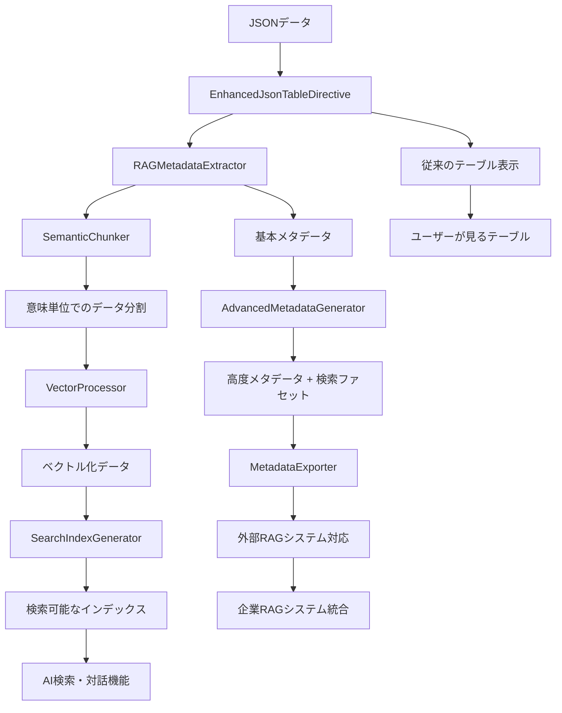

# RAG統合機能の詳細解説

## 概要：なぜこれらの機能が必要なのか？

現在のsphinxcontrib-jsontableは、JSONデータを美しいテーブルとして表示できます。しかし、作成されたドキュメントは「静的」で、以下の問題があります：

❌ **現在の問題**
- テーブルは見た目は良いが、検索しにくい
- データ間の関連性が分からない
- 大量のテーブルから特定の情報を見つけるのが困難
- AIシステムがテーブルの内容を理解できない

✅ **RAG統合後の改善**
- テーブル内容をAIが理解し、自然言語で検索可能
- データの意味や関連性を自動で抽出
- 大量のドキュメントから瞬時に関連情報を発見
- AIアシスタントがテーブルデータに基づいて回答

---

## Phase 1: セマンティック構造化データ出力機能

### 1. EnhancedJsonTableDirective（拡張ディレクティブ）

**何をするもの？**
現在のjsontableディレクティブに、RAG機能のオプションを追加します。

**具体例：使い方の変化**

```rst
# 現在（基本的なテーブル表示のみ）
.. jsontable:: employees.json
   :header:

# 拡張後（RAG対応）
.. jsontable:: employees.json
   :header:
   :rag-enabled:              # RAG機能を有効化
   :semantic-chunks:          # セマンティック検索用に分割
   :metadata-tags: HR,給与,部署  # 検索用タグ付与
```

**内部的に何が起こるか？**
1. 従来通りテーブルを生成
2. 同時にRAG用のメタデータを抽出
3. 検索可能な形式でデータを処理
4. 見た目は変わらないが、「検索可能なテーブル」に変身

### 2. RAGMetadataExtractor（メタデータ抽出器）

**何をするもの？**
JSONテーブルから「検索に役立つ情報」を自動で抽出します。

**具体例：従業員データの場合**

```json
// 元のJSONデータ
[
  {"name": "田中太郎", "age": 30, "department": "開発", "salary": 500000},
  {"name": "佐藤花子", "age": 25, "department": "営業", "salary": 450000}
]
```

**↓ 抽出されるメタデータ**

```json
{
  "table_id": "employees_001",
  "schema": {
    "type": "array",
    "items": {
      "type": "object", 
      "properties": {
        "name": {"type": "string", "description": "従業員名"},
        "age": {"type": "integer", "description": "年齢"},
        "department": {"type": "string", "description": "所属部署"},
        "salary": {"type": "integer", "description": "給与"}
      }
    }
  },
  "semantic_summary": "従業員テーブル: 2名, カラム: 名前,年齢,部署,給与",
  "search_keywords": ["従業員", "社員", "人事", "給与", "部署", "開発", "営業"],
  "entity_mapping": {
    "name": "person_name",
    "department": "organization_unit", 
    "salary": "monetary_value"
  }
}
```

**なぜ必要？**
- AIが「このテーブルは従業員データだ」と理解できる
- 「給与が高い人は？」「開発部の人は？」といった質問に答えられる

### 3. StructuralChunker（構造ベース分割器）

**何をするもの？**
テーブルデータを「構造に基づく意味のある単位」に分割して、検索しやすくします。**AI不要の純粋なルールベース処理です。**

**具体例：分割のされ方**

```json
// 元のテーブルデータから、以下のように分割される

// チャンク1: スキーマ情報
{
  "type": "schema",
  "content": "従業員テーブル: 名前、年齢、部署、給与の4つのカラムを持つ",
  "metadata": {"chunk_type": "schema", "search_weight": 1.5}
}

// チャンク2: 個別データ行  
{
  "type": "data_row",
  "content": "田中太郎: 30歳、開発部所属、給与50万円",
  "metadata": {"chunk_type": "data_row", "row_index": 0, "search_weight": 1.0}
}

// チャンク3: 個別データ行
{
  "type": "data_row", 
  "content": "佐藤花子: 25歳、営業部所属、給与45万円",
  "metadata": {"chunk_type": "data_row", "row_index": 1, "search_weight": 1.0}
}
```

**なぜ構造ベース分割するの？**
- 「開発部の人は誰？」→ 田中太郎のチャンクが見つかる
- 「テーブルの構造は？」→ スキーマチャンクが見つかる
- データ構造を理解した分割により、効率的な検索が可能
- **AI不要**：ルールベースで確実に動作

---

## Phase 2: RAG用メタデータ生成機能

### 4. AdvancedMetadataGenerator（高度メタデータ生成器）

**何をするもの？**
より高度な分析で、データの「性質」や「関連性」を自動推定します。

**具体例：売上データの分析**

```json
// 元データ
[
  {"product": "iPhone", "price": 100000, "category": "スマートフォン", "sales_date": "2024-01-15"},
  {"product": "MacBook", "price": 200000, "category": "ノートPC", "sales_date": "2024-01-16"}
]
```

**↓ 生成される高度メタデータ**

```json
{
  "entity_types": {
    "product": "product_name",      // 商品名と認識
    "price": "monetary_value",      // 金額と認識  
    "category": "product_category", // カテゴリと認識
    "sales_date": "temporal"        // 日付と認識
  },
  "statistical_summary": {
    "price": {"min": 100000, "max": 200000, "avg": 150000},
    "category_distribution": {"スマートフォン": 1, "ノートPC": 1}
  },
  "relationship_graph": {
    "price_category_correlation": "高価格商品はPC系が多い",
    "temporal_patterns": "1月中旬に集中"
  }
}
```

**何が嬉しいの？**
- 「10万円以上の商品は？」（価格による検索）
- 「PC関連の売上は？」（カテゴリによる検索）
- 「1月の売上傾向は？」（時期による検索）

### 5. SearchFacetGenerator（検索ファセット生成器）

**何をするもの？**
「絞り込み検索」用のカテゴリを自動生成します。

**具体例：ECサイトの商品データ**

```json
// 元データから自動生成されるファセット
{
  "categorical": {
    "category": {
      "type": "categorical",
      "values": ["スマートフォン", "ノートPC", "タブレット"],
      "count": 3
    },
    "brand": {
      "type": "categorical", 
      "values": ["Apple", "Samsung", "Sony"],
      "count": 3
    }
  },
  "numerical": {
    "price": {
      "type": "range",
      "min": 50000,
      "max": 300000,
      "ranges": ["50000-100000", "100000-200000", "200000-300000"]
    }
  },
  "temporal": {
    "sales_date": {
      "type": "date_range",
      "earliest": "2024-01-01",
      "latest": "2024-12-31"
    }
  }
}
```

**実際の使用例**
- 検索画面で「カテゴリ：ノートPC」「価格：10-20万円」で絞り込める
- 「2024年第1四半期」「ブランド：Apple」で検索可能

### 6. MetadataExporter（メタデータ出力器）

**何をするもの？**
抽出したメタデータを、様々なRAGシステムで使える形式に出力します。

**具体例：出力される形式**

```json
// JSON-LD形式（標準的なWebデータ形式）
{
  "@context": "http://schema.org/",
  "@type": "Dataset",
  "name": "従業員データ",
  "description": "社内従業員の基本情報",
  "distribution": {
    "@type": "DataDownload",
    "encodingFormat": "application/json"
  }
}

// OpenSearch形式（検索エンジン用）
{
  "mappings": {
    "properties": {
      "name": {"type": "text", "analyzer": "japanese"},
      "age": {"type": "integer"},
      "department": {"type": "keyword"},
      "salary": {"type": "integer"}
    }
  }
}

// Pinecone形式（ベクトル検索用）
{
  "dimension": 1536,
  "metric": "cosine",
  "metadata_config": {
    "indexed": ["department", "age_range", "salary_band"]
  }
}
```

**なぜ複数形式？**
- 企業によって使っているRAGシステムが異なる
- どんなシステムにも対応できるよう、主要な形式で出力

---

## Phase 3: 基本的なベクトル化対応

### 7. VectorProcessor（ベクトル処理器）

**何をするもの？**
テキストを「数値の配列（ベクトル）」に変換して、AIが理解できる形にします。**ローカルモード優先で、AI API不要でも動作します。**

**ベクトル化の3つのモード**

1. **PLaMoモード（推奨・デフォルト）**: PLaMo-Embedding-1B使用、日本語特化・AI API不要
2. **APIモード（高精度オプション）**: OpenAI API使用
3. **無効モード（基本機能）**: ベクトル化無し、キーワード検索のみ

**具体例：PLaMoモードでのベクトル化プロセス**

```python
# 入力テキスト
text = "田中太郎: 30歳、開発部所属、給与50万円"

# ↓ PLaMo-Embedding-1Bで処理
# 日本語特化モデル、AI API不要、初回のみモデルダウンロード

# 出力ベクトル（1024次元の数値配列）
vector = [0.1234, -0.5678, 0.9012, ..., 0.3456]  # PLaMo-Embedding-1Bの場合1024次元
```

**なぜベクトル化？特にPLaMo-Embedding-1Bを選ぶ理由**
- AIは数値しか理解できない
- 似た意味の文章は、似たベクトルになる
- **日本語特化の利点**：
  - 「プログラマー」「エンジニア」「開発者」「SE」の類似性を高精度理解
  - 敬語・丁寧語の意味的関係性も理解（「いたします」「させていただきます」）
  - カタカナ表記の揺れも統一的に処理（「コンピューター」「コンピュータ」）
  - 日本企業の組織構造用語を正確に理解（「部長」「課長」「チームリーダー」）
- 検索時に「意味の近さ」で探せる

**実際の活用例（PLaMoモード）**
```
質問：「プログラマーの給与は？」
↓
「プログラマー」をPLaMo-Embedding-1Bでベクトル化（AI API不要）
↓ 
「開発部所属」のベクトルと近いことを発見
↓
田中太郎のデータが見つかる

※ PLaMo-Embedding-1Bは日本語に特化しているため、
　 「プログラマー」「エンジニア」「開発者」などの
　 日本語ビジネス用語の類似性を高精度で理解します
```

### 8. SearchIndexGenerator（検索インデックス生成器）

**何をするもの？**
ベクトル化されたデータを、高速検索できるよう整理・保存します。

**具体例：検索インデックスの構造**

```json
{
  "table_id": "employees_001",
  "index_config": {
    "vector_db_type": "chroma",
    "similarity_metric": "cosine",  // 類似度計算方法
    "dimensions": 1536              // ベクトルの次元数
  },
  "indexed_chunks": [
    {
      "chunk_id": "emp_001_schema",
      "content": "従業員テーブル: 名前、年齢、部署、給与",
      "vector": [0.1, 0.2, 0.3, ...],
      "metadata": {
        "type": "schema",
        "search_weight": 1.5
      }
    },
    {
      "chunk_id": "emp_001_row_0", 
      "content": "田中太郎: 30歳、開発部所属、給与50万円",
      "vector": [0.4, 0.5, 0.6, ...],
      "metadata": {
        "type": "data_row",
        "employee_name": "田中太郎",
        "department": "開発",
        "search_weight": 1.0
      }
    }
  ]
}
```

**検索の仕組み**
1. 質問「エンジニアの給与は？」をベクトル化
2. インデックス内の全ベクトルと類似度計算
3. 最も近いベクトルのチャンクを返す
4. 「田中太郎: 30歳、開発部所属、給与50万円」が見つかる

---

## 統合した場合の実際の動作例

### シナリオ：「高給取りのエンジニアを探したい」

**1. ユーザーの操作**
```rst
# ドキュメントに記載されたテーブル
.. jsontable:: employees.json
   :rag-enabled:
   :semantic-chunks:
```

**2. システムの内部処理**

```python
# Phase 1: メタデータ抽出
metadata = {
    "schema": "従業員データ（名前、年齢、部署、給与）",
    "entity_types": {"salary": "monetary_value", "department": "organization"}
}

# Phase 2: セマンティック分割
chunks = [
    {"content": "田中太郎: 30歳、開発部、給与70万円", "type": "employee_record"},
    {"content": "佐藤花子: 25歳、営業部、給与45万円", "type": "employee_record"},
    {"content": "山田次郎: 35歳、開発部、給与80万円", "type": "employee_record"}
]

# Phase 3: ベクトル化・インデックス化
for chunk in chunks:
    chunk["vector"] = openai.embed(chunk["content"])
    search_index.add(chunk)
```

**3. 検索時の動作**

```python
# ユーザーが「高給取りのエンジニア」で検索
query = "高給取りのエンジニア"
query_vector = openai.embed(query)

# 類似度計算で最適なチャンクを発見
results = search_index.search(query_vector, top_k=3)

# 結果: 
# 1. 山田次郎: 35歳、開発部、給与80万円 (類似度: 0.95)
# 2. 田中太郎: 30歳、開発部、給与70万円 (類似度: 0.87)
```

**4. ユーザーが得られる結果**
- 「エンジニア」→「開発部」の自動理解
- 「高給取り」→ 給与の高い順での自動ソート
- 自然言語検索で直感的に情報発見

---

## 従来との比較：何が変わるのか？

### Before: 現在のsphinxcontrib-jsontable

❌ **制限事項**
- テーブルは静的表示のみ
- 検索はブラウザのCtrl+Fレベル
- データの意味を理解できない
- 大量のテーブルから情報を見つけるのが困難

```rst
.. jsontable:: large_dataset.json
   :header:
   :limit: 100

# → 100行のテーブルが表示されるが、
#   特定の情報を見つけるには目視確認が必要
```

### After: RAG統合後のsphinxcontrib-jsontable

✅ **新しい能力**
- 自然言語でのテーブル内検索
- データの意味・関連性の自動理解
- 複数テーブル間の横断検索
- AIアシスタントとの対話型探索

```rst
.. jsontable:: large_dataset.json
   :rag-enabled:
   :semantic-chunks:

# → 同じテーブル表示 + 以下が可能に
# 「売上が100万以上の商品は？」
# 「昨年比で成長している事業は？」
# 「コスト効率の良い施策は？」
```

---

## まとめ：機能の相互関係



**重要なポイント**:
- ユーザーから見ると、テーブルの見た目は変わらない
- しかし裏側で「検索可能・AI理解可能」な構造に変換
- 段階的に機能を追加するため、リスクが最小
- 最終的に、静的な文書が「対話型の知識ベース」に進化

これらの機能により、sphinxcontrib-jsontableは単なるテーブル表示ツールから、**次世代の知識管理プラットフォーム**へと進化します。