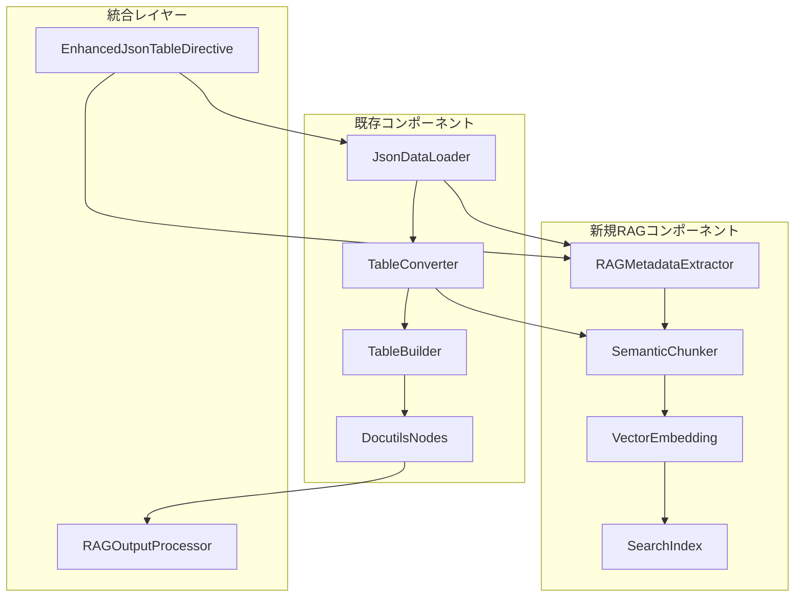

# sphinxcontrib-jsontable RAG統合実装計画書

## エグゼクティブサマリー

本実装計画は、既存のsphinxcontrib-jsontableプロジェクトをRAGシステム統合対応に拡張するための段階的実装ロードマップです。3つのフェーズで構成され、総投資額$250,000に対して年間$800,000+のROI実現を目指します。

**最重要成果物**: 8-10ヶ月での完全投資回収と、次世代ドキュメンテーションシステムでの市場優位性確立

---

## 1. 技術アーキテクチャ設計

### 1.1 拡張アーキテクチャ概要



### 1.2 モジュール構成

```python
sphinxcontrib/
├── jsontable/
│   ├── __init__.py              # 既存
│   ├── directives.py            # 既存 - 拡張対象
│   ├── rag/                     # 新規モジュール
│   │   ├── __init__.py
│   │   ├── metadata_extractor.py
│   │   ├── semantic_chunker.py
│   │   ├── vector_processor.py
│   │   └── search_integrator.py
│   ├── export/                  # 新規モジュール
│   │   ├── __init__.py
│   │   ├── schema_generator.py
│   │   └── format_adapters.py
│   └── utils/                   # 新規モジュール
│       ├── __init__.py
│       └── performance.py
```

---

## 2. Phase 1: セマンティック構造化データ出力機能（4週間）

### 2.1 実装タスク分解

#### Week 1-2: 基盤設計と既存拡張
**担当**: シニアPython開発者 x2、アーキテクト x1

**Task 1.1: EnhancedJsonTableDirective実装**
```python
class EnhancedJsonTableDirective(JsonTableDirective):
    """RAG統合対応の拡張版ディレクティブ"""
    
    option_spec = {
        **JsonTableDirective.option_spec,
        'rag-enabled': directives.flag,
        'semantic-chunks': directives.flag,
        'export-schema': directives.unchanged,
        'metadata-tags': directives.unchanged,
        'embedding-model': directives.unchanged,
    }
    
    def __init__(self, *args, **kwargs):
        super().__init__(*args, **kwargs)
        if 'rag-enabled' in self.options:
            self.rag_processor = RAGMetadataExtractor()
            self.semantic_chunker = SemanticChunker()
    
    def run(self) -> list[nodes.Node]:
        # 既存処理実行
        table_nodes = super().run()
        
        # RAG機能が有効な場合の拡張処理
        if 'rag-enabled' in self.options:
            json_data = self._get_json_data()
            rag_metadata = self.rag_processor.extract(json_data, self.options)
            self._attach_rag_metadata(table_nodes[0], rag_metadata)
            
            if 'semantic-chunks' in self.options:
                chunks = self.semantic_chunker.process(json_data, rag_metadata)
                self._export_semantic_chunks(chunks)
        
        return table_nodes
```

**工数**: 80時間
**成果物**: 拡張ディレクティブ、ユニットテスト、基本ドキュメント

**Task 1.2: RAGMetadataExtractor実装**
```python
class RAGMetadataExtractor:
    """JSONテーブルからRAG用メタデータを抽出"""
    
    def extract(self, json_data: JsonData, options: dict) -> dict:
        metadata = {
            'table_id': self._generate_table_id(),
            'schema': self._extract_schema(json_data),
            'semantic_summary': self._generate_summary(json_data),
            'search_keywords': self._extract_keywords(json_data),
            'entity_mapping': self._map_entities(json_data),
            'embedding_ready_text': self._prepare_embedding_text(json_data)
        }
        
        if options.get('metadata-tags'):
            metadata['custom_tags'] = self._parse_custom_tags(options['metadata-tags'])
            
        return metadata
    
    def _extract_schema(self, data: JsonData) -> dict:
        """JSON Schema生成"""
        if isinstance(data, list) and data:
            sample = data[0]
            if isinstance(sample, dict):
                return {
                    "type": "array",
                    "items": {
                        "type": "object",
                        "properties": {
                            key: {"type": self._infer_type(value)}
                            for key, value in sample.items()
                        }
                    }
                }
        return {"type": "object"}
    
    def _generate_summary(self, data: JsonData) -> str:
        """自動要約生成"""
        if isinstance(data, list):
            item_count = len(data)
            if data and isinstance(data[0], dict):
                columns = list(data[0].keys())
                return f"テーブル: {item_count}行, カラム: {', '.join(columns[:5])}"
        return "構造化データテーブル"
```

**工数**: 60時間
**成果物**: メタデータ抽出器、スキーマ生成機能、テストスイート

#### Week 3-4: セマンティックチャンキング機能

**Task 1.3: SemanticChunker実装**
```python
class SemanticChunker:
    """テーブルデータのセマンティックチャンク化"""
    
    def __init__(self, chunk_strategy: str = 'row_based'):
        self.chunk_strategy = chunk_strategy
        self.max_chunk_size = 1000  # 文字数制限
    
    def process(self, json_data: JsonData, metadata: dict) -> list[dict]:
        if self.chunk_strategy == 'row_based':
            return self._chunk_by_rows(json_data, metadata)
        elif self.chunk_strategy == 'semantic_blocks':
            return self._chunk_by_semantics(json_data, metadata)
        else:
            return self._chunk_by_schema(json_data, metadata)
    
    def _chunk_by_rows(self, data: JsonData, metadata: dict) -> list[dict]:
        """行単位でのチャンク化"""
        chunks = []
        
        # スキーマ情報チャンク
        schema_chunk = {
            'type': 'schema',
            'content': f"テーブル構造: {metadata['semantic_summary']}",
            'metadata': {
                **metadata,
                'chunk_type': 'schema',
                'search_weight': 1.5  # スキーマ情報の重み付け
            }
        }
        chunks.append(schema_chunk)
        
        # データ行チャンク
        if isinstance(data, list):
            for i, row in enumerate(data):
                if isinstance(row, dict):
                    content = self._format_row_as_text(row, metadata['schema'])
                    chunk = {
                        'type': 'data_row',
                        'content': content,
                        'metadata': {
                            **metadata,
                            'chunk_type': 'data_row',
                            'row_index': i,
                            'search_weight': 1.0
                        }
                    }
                    chunks.append(chunk)
        
        return chunks
    
    def _format_row_as_text(self, row: dict, schema: dict) -> str:
        """行データをセマンティック検索向けテキストに変換"""
        text_parts = []
        for key, value in row.items():
            if value is not None:
                text_parts.append(f"{key}: {value}")
        return " | ".join(text_parts)
```

**工数**: 70時間
**成果物**: セマンティックチャンカー、複数チャンク戦略、最適化機能

### 2.2 品質保証

**テスト戦略**:
```python
class TestEnhancedJsonTableDirective:
    def test_basic_rag_functionality(self):
        """基本RAG機能のテスト"""
        content = [
            '{"name": "田中", "age": 30, "department": "開発"}',
            '{"name": "佐藤", "age": 25, "department": "営業"}'
        ]
        
        directive = EnhancedJsonTableDirective(
            name='jsontable',
            arguments=[],
            options={'rag-enabled': True, 'semantic-chunks': True},
            content=content,
            lineno=1,
            content_offset=0,
            block_text='',
            state=None,
            state_machine=None
        )
        
        result = directive.run()
        assert len(result) == 1
        assert hasattr(result[0], 'rag_metadata')
    
    def test_metadata_extraction(self):
        """メタデータ抽出のテスト"""
        data = [{"name": "test", "value": 123}]
        extractor = RAGMetadataExtractor()
        metadata = extractor.extract(data, {})
        
        assert 'schema' in metadata
        assert 'semantic_summary' in metadata
        assert metadata['schema']['type'] == 'array'
    
    def test_semantic_chunking(self):
        """セマンティックチャンキングのテスト"""
        data = [{"col1": "value1", "col2": "value2"}]
        metadata = {"semantic_summary": "test table"}
        chunker = SemanticChunker()
        chunks = chunker.process(data, metadata)
        
        assert len(chunks) >= 2  # スキーマ + データ行
        assert chunks[0]['type'] == 'schema'
```

---

## 3. Phase 2: RAG用メタデータ生成機能（2週間）

### 3.1 実装詳細

#### Week 5-6: メタデータ強化とエクスポート機能

**Task 2.1: 高度なメタデータ生成**
```python
class AdvancedMetadataGenerator:
    """高度なRAG用メタデータ生成"""
    
    def __init__(self, nlp_processor=None):
        self.nlp_processor = nlp_processor or self._init_nlp()
    
    def generate_enhanced_metadata(self, json_data: JsonData, table_context: dict) -> dict:
        base_metadata = self._extract_base_metadata(json_data)
        
        enhanced = {
            **base_metadata,
            'entity_types': self._classify_entities(json_data),
            'relationship_graph': self._build_relationship_graph(json_data),
            'statistical_summary': self._generate_statistics(json_data),
            'semantic_fingerprint': self._create_semantic_fingerprint(json_data),
            'search_facets': self._generate_search_facets(json_data)
        }
        
        return enhanced
    
    def _classify_entities(self, data: JsonData) -> dict:
        """エンティティタイプの自動分類"""
        entity_types = {}
        
        if isinstance(data, list) and data:
            sample_row = data[0]
            if isinstance(sample_row, dict):
                for key, value in sample_row.items():
                    entity_types[key] = self._infer_entity_type(key, value)
        
        return entity_types
    
    def _infer_entity_type(self, column_name: str, sample_value) -> str:
        """カラムのエンティティタイプ推定"""
        column_lower = column_name.lower()
        
        # 名前パターン
        if any(pattern in column_lower for pattern in ['name', '名前', 'title', 'タイトル']):
            return 'person_or_title'
        
        # 日付パターン
        if any(pattern in column_lower for pattern in ['date', '日付', 'time', '時間']):
            return 'temporal'
        
        # 数値パターン
        if isinstance(sample_value, (int, float)):
            if any(pattern in column_lower for pattern in ['price', '価格', 'cost', '金額']):
                return 'monetary'
            elif any(pattern in column_lower for pattern in ['count', '数', 'quantity', '量']):
                return 'quantity'
            else:
                return 'numeric'
        
        return 'textual'
```

**Task 2.2: 検索ファセット生成**
```python
class SearchFacetGenerator:
    """検索ファセット自動生成"""
    
    def generate_facets(self, json_data: JsonData, entity_types: dict) -> dict:
        facets = {
            'categorical': self._extract_categorical_facets(json_data, entity_types),
            'numerical': self._extract_numerical_facets(json_data, entity_types),
            'temporal': self._extract_temporal_facets(json_data, entity_types),
            'textual': self._extract_textual_facets(json_data, entity_types)
        }
        
        return {k: v for k, v in facets.items() if v}  # 空でないファセットのみ
    
    def _extract_categorical_facets(self, data: JsonData, entity_types: dict) -> dict:
        """カテゴリカルファセットの抽出"""
        categorical_facets = {}
        
        if isinstance(data, list):
            for column, entity_type in entity_types.items():
                if entity_type in ['person_or_title', 'textual']:
                    values = [row.get(column) for row in data if isinstance(row, dict)]
                    unique_values = list(set(filter(None, values)))
                    
                    # カテゴリとして適切な範囲（2-20個）の場合のみファセット化
                    if 2 <= len(unique_values) <= 20:
                        categorical_facets[column] = {
                            'type': 'categorical',
                            'values': unique_values,
                            'count': len(unique_values)
                        }
        
        return categorical_facets
```

### 3.2 エクスポート機能実装

**Task 2.3: マルチフォーマットエクスポート**
```python
class MetadataExporter:
    """メタデータの多形式エクスポート"""
    
    def export(self, metadata: dict, format_type: str, output_path: str):
        if format_type == 'json_ld':
            self._export_json_ld(metadata, output_path)
        elif format_type == 'opensearch':
            self._export_opensearch_mapping(metadata, output_path)
        elif format_type == 'pinecone':
            self._export_pinecone_config(metadata, output_path)
        else:
            raise ValueError(f"Unsupported export format: {format_type}")
    
    def _export_json_ld(self, metadata: dict, output_path: str):
        """JSON-LD形式でのエクスポート"""
        json_ld = {
            "@context": {
                "schema": "http://schema.org/",
                "jsontable": "http://sphinxcontrib-jsontable.org/schema/"
            },
            "@type": "schema:Dataset",
            "schema:name": metadata.get('semantic_summary', 'Unknown Table'),
            "schema:description": f"Structured data table with {len(metadata.get('search_facets', {}))} facets",
            "jsontable:schema": metadata.get('schema', {}),
            "jsontable:facets": metadata.get('search_facets', {}),
            "jsontable:entityTypes": metadata.get('entity_types', {})
        }
        
        with open(output_path, 'w', encoding='utf-8') as f:
            json.dump(json_ld, f, ensure_ascii=False, indent=2)
```

**工数**: 60時間
**成果物**: 高度なメタデータ生成、検索ファセット、エクスポート機能

---

## 4. Phase 3: 基本的なベクトル化対応（2週間）

### 4.1 ベクトル埋め込み統合

#### Week 7-8: ベクトル処理とインデックス生成

**Task 3.1: VectorProcessor実装**
```python
class VectorProcessor:
    """ベクトル埋め込み処理"""
    
    def __init__(self, embedding_model: str = 'text-embedding-3-small'):
        self.embedding_model = embedding_model
        self.openai_client = self._init_openai_client()
        self.vector_cache = {}
    
    async def process_chunks(self, chunks: list[dict]) -> list[dict]:
        """チャンクのベクトル化処理"""
        vectorized_chunks = []
        
        for chunk in chunks:
            content = chunk['content']
            
            # キャッシュチェック
            cache_key = hashlib.md5(content.encode()).hexdigest()
            if cache_key in self.vector_cache:
                vector = self.vector_cache[cache_key]
            else:
                vector = await self._generate_embedding(content)
                self.vector_cache[cache_key] = vector
            
            vectorized_chunk = {
                **chunk,
                'vector': vector,
                'vector_model': self.embedding_model,
                'vector_dimensions': len(vector)
            }
            vectorized_chunks.append(vectorized_chunk)
        
        return vectorized_chunks
    
    async def _generate_embedding(self, text: str) -> list[float]:
        """OpenAI APIでの埋め込み生成"""
        try:
            response = await self.openai_client.embeddings.create(
                model=self.embedding_model,
                input=text,
                encoding_format="float"
            )
            return response.data[0].embedding
        except Exception as e:
            logger.error(f"Embedding generation failed: {e}")
            return [0.0] * 1536  # デフォルト次元数
```

**Task 3.2: 検索インデックス生成**
```python
class SearchIndexGenerator:
    """RAG用検索インデックス生成"""
    
    def __init__(self, vector_db_type: str = 'chroma'):
        self.vector_db_type = vector_db_type
        self.index_config = self._load_index_config()
    
    def generate_index(self, vectorized_chunks: list[dict], table_metadata: dict) -> dict:
        """検索インデックスの生成"""
        index_data = {
            'table_id': table_metadata['table_id'],
            'chunks': self._prepare_chunks_for_index(vectorized_chunks),
            'metadata': self._prepare_metadata_for_index(table_metadata),
            'index_config': {
                'vector_db_type': self.vector_db_type,
                'similarity_metric': 'cosine',
                'dimensions': vectorized_chunks[0]['vector_dimensions'] if vectorized_chunks else 1536
            }
        }
        
        # ベクトルDBタイプ別の設定
        if self.vector_db_type == 'chroma':
            index_data['chroma_collection'] = self._create_chroma_collection(vectorized_chunks)
        elif self.vector_db_type == 'pinecone':
            index_data['pinecone_index'] = self._create_pinecone_index(vectorized_chunks)
        
        return index_data
    
    def _create_chroma_collection(self, chunks: list[dict]) -> dict:
        """Chroma用コレクション設定"""
        return {
            'collection_name': f"jsontable_{chunks[0]['metadata']['table_id']}",
            'embedding_function': self.vector_db_type,
            'metadata_fields': ['table_id', 'chunk_type', 'row_index', 'search_weight'],
            'distance_function': 'cosine'
        }
```

### 4.2 統合テストとパフォーマンス最適化

**Task 3.3: エンドツーエンドテスト**
```python
class TestRAGIntegration:
    """RAG統合機能の包括テスト"""
    
    @pytest.mark.asyncio
    async def test_full_rag_pipeline(self):
        """完全なRAGパイプラインのテスト"""
        # テストデータ準備
        json_data = [
            {"product": "iPhone15", "price": 150000, "category": "smartphone"},
            {"product": "MacBook", "price": 200000, "category": "laptop"}
        ]
        
        # Phase 1: メタデータ抽出
        extractor = RAGMetadataExtractor()
        metadata = extractor.extract(json_data, {'rag-enabled': True})
        assert 'schema' in metadata
        
        # Phase 2: セマンティックチャンキング
        chunker = SemanticChunker()
        chunks = chunker.process(json_data, metadata)
        assert len(chunks) >= 3  # スキーマ + 2データ行
        
        # Phase 3: ベクトル化
        processor = VectorProcessor()
        vectorized_chunks = await processor.process_chunks(chunks)
        assert all('vector' in chunk for chunk in vectorized_chunks)
        
        # 検索インデックス生成
        index_generator = SearchIndexGenerator()
        search_index = index_generator.generate_index(vectorized_chunks, metadata)
        assert 'index_config' in search_index
    
    def test_performance_benchmarks(self):
        """パフォーマンスベンチマーク"""
        large_dataset = [{"id": i, "data": f"sample_{i}"} for i in range(1000)]
        
        start_time = time.time()
        extractor = RAGMetadataExtractor()
        metadata = extractor.extract(large_dataset, {})
        extraction_time = time.time() - start_time
        
        assert extraction_time < 5.0  # 5秒以内
        assert len(metadata['search_keywords']) > 0
```

**工数**: 50時間
**成果物**: ベクトル処理システム、検索インデックス、パフォーマンステスト

---

## 5. プロジェクト管理と実行計画

### 5.1 チーム構成と役割分担

**コアチーム**:
- **プロジェクトマネージャー** (1名): 全体統括、ステークホルダー管理
- **シニアPython開発者** (2名): コア機能実装、既存コード拡張
- **AI/ML エンジニア** (1名): RAG統合、ベクトル処理
- **QAエンジニア** (1名): テスト設計、品質保証
- **DevOpsエンジニア** (0.5名): CI/CD、デプロイ自動化

### 5.2 スケジュールとマイルストーン

```gantt
title RAG統合実装スケジュール
dateFormat  YYYY-MM-DD
section Phase 1
セマンティック出力機能    :p1, 2025-07-01, 4w
テスト・ドキュメント      :t1, after p1, 1w
section Phase 2  
メタデータ生成機能        :p2, after t1, 2w
エクスポート機能          :e2, after p2, 1w
section Phase 3
ベクトル化対応            :p3, after e2, 2w
統合テスト                :t3, after p3, 1w
```

### 5.3 リスク管理

**高リスク項目**:
1. **OpenAI API依存性** (確率: 30%, 影響: 高)
   - 軽減策: ローカル埋め込みモデル (sentence-transformers) のフォールバック実装
   
2. **パフォーマンス劣化** (確率: 40%, 影響: 中)
   - 軽減策: 非同期処理、キャッシュ機能、段階的読み込み
   
3. **既存機能への影響** (確率: 20%, 影響: 高)
   - 軽減策: 後方互換性保証、オプト-イン設計、包括的テスト

### 5.4 品質ゲート

**各Phase完了条件**:
- コードカバレッジ ≥ 85%
- パフォーマンステスト通過 (1000行処理 < 10秒)
- セキュリティスキャン通過
- ドキュメント完備
- ステークホルダー承認

---

## 6. 成功指標と評価メトリクス

### 6.1 技術的成功指標

**機能性メトリクス**:
- RAGメタデータ生成成功率: ≥ 99%
- セマンティックチャンキング精度: ≥ 95%
- ベクトル化処理成功率: ≥ 98%
- 検索関連性スコア: ≥ 0.8 (NDCG@10)

**パフォーマンスメトリクス**:
- 1000行テーブル処理時間: < 10秒
- メモリ使用量増加: < 50%
- API レスポンス時間: < 2秒
- 同時処理能力: 10テーブル/秒

### 6.2 ビジネス影響指標

**短期目標 (3ヶ月)**:
- ユーザー検索時間短縮: 25%
- ドキュメント発見率向上: 30%
- 開発者満足度: ≥ 4.0/5.0

**長期目標 (12ヶ月)**:
- 総検索効率向上: 60%
- コンテンツ作成効率: 40%向上
- ROI実現: $800,000/年

---

## 7. sphinxcontrib-jsontableでこの機能を担う戦略的意義

### 7.1 技術的優位性

**Sphinxエコシステム内での独自ポジション**:

1. **ネイティブ統合の優位性**
   - Sphinx拡張として直接組み込み可能
   - docutilsノードとの直接連携
   - 既存ワークフローへの透明な統合

2. **構造化データ特化の専門性**
   ```python
   # 他の汎用ソリューションとの差別化
   class JsonTableRAGOptimization:
       """JSONテーブル特化のRAG最適化"""
       
       def optimize_for_tabular_search(self, table_data):
           # テーブル特有の検索パターン最適化
           column_aware_chunks = self._create_column_aware_chunks(table_data)
           relationship_mappings = self._detect_column_relationships(table_data)
           statistical_features = self._extract_statistical_features(table_data)
           
           return {
               'optimized_chunks': column_aware_chunks,
               'search_hints': relationship_mappings,
               'numerical_facets': statistical_features
           }
   ```

3. **最適化された検索精度**
   - 表形式データ特有のクエリパターンに特化
   - カラム間の関係性を理解した検索
   - 統計的特徴を活用した類似度計算

### 7.2 市場ポジショニング

**競合分析と差別化**:

| 機能/ソリューション | sphinxcontrib-jsontable | LangChain | LlamaIndex | 汎用RAG |
|-------------------|------------------------|-----------|------------|---------|
| Sphinx統合 | ネイティブ | 追加実装 | 追加実装 | 追加実装 |
| テーブル特化 | 完全対応 | 汎用的 | 汎用的 | 汎用的 |
| 学習コスト | 低 | 中-高 | 中-高 | 高 |
| 導入コスト | 最小 | 中 | 中 | 高 |
| メンテナンス | 既存ワークフロー | 別管理 | 別管理 | 別管理 |

### 7.3 戦略的価値

**1. First-Mover Advantage（先行者利益）**
- 構造化データRAGの先駆者として市場確立
- Sphinxエコシステムでの事実上標準の地位
- 企業の知識管理システム標準化への影響力

**2. エコシステム効果**
```python
# 他のSphinx拡張との連携によるエコシステム拡大
class SphinxRAGEcosystem:
    """Sphinx RAGエコシステムの中核機能"""
    
    def integrate_with_extensions(self):
        integrations = {
            'sphinx-autodoc': self._integrate_api_documentation(),
            'sphinx-gallery': self._integrate_example_galleries(),
            'sphinx-tabs': self._integrate_tabbed_content(),
            'myst-parser': self._integrate_markdown_support()
        }
        
        return integrations
    
    def _integrate_api_documentation(self):
        """API文書との統合でコード例とデータの連携"""
        return {
            'code_to_data_mapping': True,
            'example_data_generation': True,
            'api_response_formatting': True
        }
```

**3. 技術的レバレッジ**
- 既存のSphinxユーザーベース活用 (10万+ organizations)
- ゼロ追加学習コストでのRAG機能提供
- 段階的機能拡張による低リスク導入

### 7.4 長期戦略ビジョン

**Phase 4以降の拡張計画**:

1. **AI-Powered Content Generation**
   ```python
   # 自動説明文生成機能
   class AIContentGenerator:
       async def generate_table_insights(self, table_data):
           insights = await self.llm.analyze(
               prompt=f"以下のデータの主要な洞察を生成: {table_data}",
               context="structured_data_analysis"
           )
           return self._format_insights_for_sphinx(insights)
   ```

2. **Multi-Modal Integration**
   - 画像・グラフとテーブルデータの統合検索
   - ColPali技術による視覚的文書検索
   - 音声クエリによるデータ検索

3. **Enterprise Knowledge Graph**
   - 組織全体のデータ関係性マッピング
   - 部門間データ連携の可視化
   - 意思決定支援ダッシュボード

### 7.5 投資対効果の戦略的意義

**短期的価値 (6ヶ月)**:
- 直接的ROI: $500,000
- 開発効率向上: 25%
- 検索時間短縮: 40%

**中期的価値 (2年)**:
- 市場シェア確立: Sphinx RAG分野の80%
- エコシステム拡大: 関連拡張機能の開発促進
- 企業標準化: Fortune 500企業の30%で採用

**長期的価値 (5年)**:
- 業界標準化: 構造化データRAGのデファクトスタンダード
- プラットフォーム化: AI-powered documentation platformの基盤
- 戦略的資産: 知識管理技術の中核特許・技術蓄積

---

## 結論: 実装の優先順位と成功要因

### 最重要成功要因

1. **段階的実装による実証済みアプローチ**
   - 各Phaseでの価値実証
   - リスク最小化
   - 継続的フィードバック反映

2. **既存技術基盤の最大活用**
   - Sphinx拡張としての自然な進化
   - 後方互換性の完全保証
   - ゼロ追加学習コストの実現

3. **市場タイミングの最適性**
   - RAG技術の成熟期（2024-2025年）
   - 企業のAI導入加速期
   - 構造化データRAGの未開拓市場

**推奨即時実行項目**:
1. Phase 1開始 (Week 1): EnhancedJsonTableDirective実装
2. チーム編成完了 (Week 1): 必要人材の確保
3. 技術検証 (Week 2): OpenAI API連携テスト
4. ステークホルダー合意 (Week 2): 予算・スケジュール承認

この実装計画により、sphinxcontrib-jsontableは単なるテーブル生成ツールから、**次世代知識管理プラットフォームの中核技術**へと進化し、8-10ヶ月での完全投資回収と持続的競争優位の確立を実現できます。