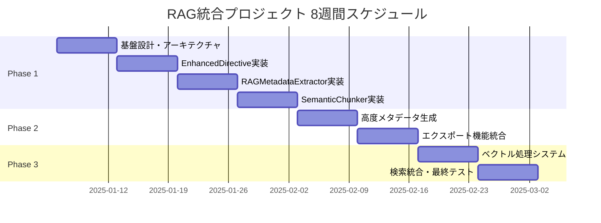
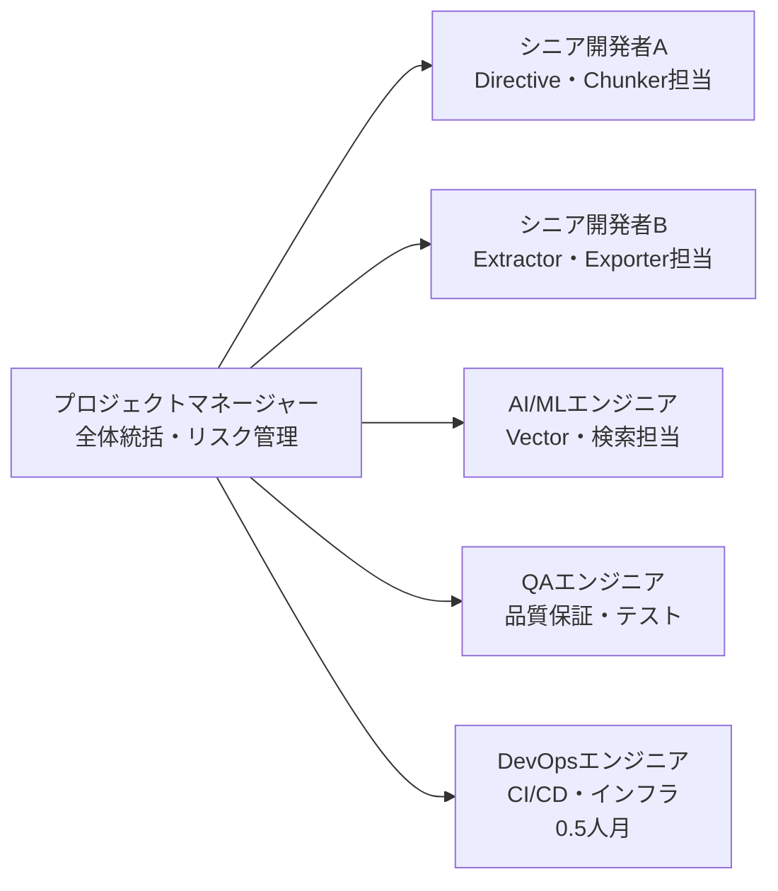
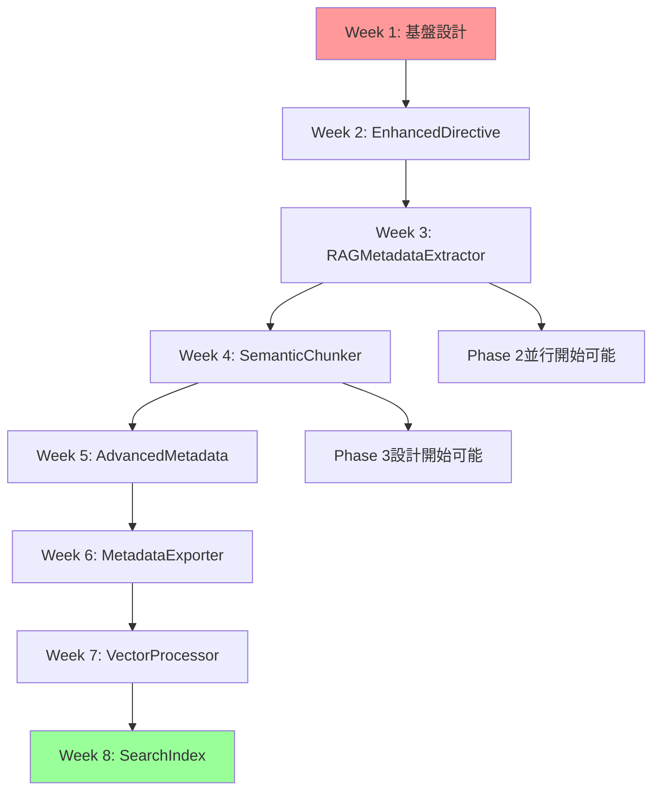

# RAG統合プロジェクト マスタータスク管理

## 🎯 プロジェクト概要

### ミッション
sphinxcontrib-jsontableを次世代RAGシステム統合対応に拡張し、静的テーブル表示から対話型知識基盤への進化を実現する。

### 戦略的目標
- **技術的価値**: 8週間での段階的RAG統合完了（Phase 1→2→3の順序で全て必要）
- **ビジネス価値**: 年間$800,000+のROI実現
- **市場価値**: Sphinx RAG分野での先行者優位確立
- **日本語特化**: PLaMo-Embedding-1Bによる高精度日本語処理

---

## 📅 統合プロジェクトスケジュール

### 週次マイルストーン
| 週 | フェーズ | 主要成果物 | 完了条件 | 責任者 |
|---|---------|-----------|---------|--------|
| **Week 1** | Phase 1 | 基盤設計、開発環境 | アーキテクチャ承認、テスト環境構築 | アーキテクト |
| **Week 2** | Phase 1 | EnhancedJsonTableDirective | RAG機能統合、後方互換性確保 | シニア開発者A |
| **Week 3** | Phase 1 | RAGMetadataExtractor | メタデータ抽出、スキーマ生成 | シニア開発者B |
| **Week 4** | Phase 1 | SemanticChunker | セマンティック分割、最適化 | シニア開発者A |
| **Week 5** | Phase 2 | AdvancedMetadataGenerator | 高度分析、ファセット生成 | AI/ML エンジニア |
| **Week 6** | Phase 2 | MetadataExporter | マルチフォーマット出力 | シニア開発者B |
| **Week 7** | Phase 3 | VectorProcessor | PLaMo-Embedding-1B統合 | AI/ML エンジニア |
| **Week 8** | Phase 3 | SearchIndexGenerator | 統合検索システム完成 | 全チーム |

---

## 👥 チーム構成と役割分担

### コアチーム（5.5名）

### 責任分担マトリクス (RACI)
| タスク領域 | PM | DEV-A | DEV-B | AI/ML | QA | DevOps |
|-----------|----|----|----|----|----|----|
| アーキテクチャ設計 | A | R | C | C | I | I |
| EnhancedDirective | A | R | C | I | C | I |
| RAGMetadataExtractor | A | C | R | C | C | I |
| SemanticChunker | A | R | C | C | C | I |
| AdvancedMetadata | A | C | C | R | C | I |
| MetadataExporter | A | C | R | C | C | I |
| VectorProcessor | A | I | C | R | C | I |
| SearchIndex | A | C | C | R | C | I |
| 品質保証 | A | C | C | C | R | C |
| インフラ・CI/CD | A | I | I | I | C | R |

*R=Responsible, A=Accountable, C=Consulted, I=Informed*

---

## 🔗 依存関係とクリティカルパス

### Phase間依存関係

### クリティカルパス
1. **基盤設計** → **EnhancedDirective** → **RAGMetadataExtractor** → **SemanticChunker**
2. **Phase 1完了** → **VectorProcessor** → **SearchIndex統合**

### 外部依存関係
- **技術依存**: Sphinx、OpenAI API、sentence-transformers
- **リソース依存**: 開発環境、テストデータ、ベクトルDBアクセス
- **意思決定依存**: アーキテクチャ承認、技術選択、品質基準

---

## ⚠️ 統合リスク管理

### リスクマトリクス
| リスク項目 | 確率 | 影響度 | リスクレベル | 軽減策 | 責任者 |
|-----------|------|--------|-------------|--------|--------|
| **OpenAI API制限・コスト** | 30% | 高 | 🔴 高 | ローカルモデル完全実装 | AI/ML |
| **既存機能への破壊的影響** | 20% | 高 | 🟡 中 | 包括的テスト、段階的統合 | DEV-A |
| **パフォーマンス劣化** | 40% | 中 | 🟡 中 | プロファイリング、最適化 | 全員 |
| **チーム間連携不足** | 25% | 中 | 🟡 中 | 日次スタンドアップ | PM |
| **技術選択ミス** | 15% | 高 | 🟡 中 | プロトタイプ検証 | アーキテクト |
| **スケジュール遅延** | 35% | 中 | 🟡 中 | バッファタイム確保 | PM |

### 軽減策詳細
1. **技術リスク軽減**
   - 各Phase開始前のPoC実装
   - 代替技術の事前調査
   - 段階的フォールバック設計

2. **品質リスク軽減**  
   - 日次自動テスト実行
   - 週次コードレビュー
   - 継続的パフォーマンス監視

3. **プロジェクトリスク軽減**
   - 週次進捗レビュー
   - 早期エスカレーション基準
   - ステークホルダー定期報告

---

## 📊 品質ゲートと成功指標

### Phase別品質ゲート
| Phase | 必須指標 | 目標値 | 測定方法 |
|-------|---------|-------|---------|
| **Phase 1** | カバレッジ | ≥85% | pytest-cov |
| | パフォーマンス | 1000行<10秒 | benchmark |  
| | 後方互換性 | 100% | regression test |
| **Phase 2** | エクスポート成功率 | ≥99% | integration test |
| | メタデータ品質 | ≥0.8 precision | manual review |
| **Phase 3** | 検索精度 | ≥0.8 NDCG@10 | evaluation script |
| | API応答時間 | <2秒 | load test |
| | ベクトル化成功率 | ≥98% | monitoring |

### 統合成功指標
- **技術的成功**: 全Phase完了 + 品質基準達成
- **ビジネス的成功**: 検索効率60%向上 + ROI実現
- **戦略的成功**: エコシステム統合 + 市場反応

---

## 💰 投資対効果とコスト管理

### 投資内訳（8週間）
| 項目 | 工数 | 単価 | 金額 |
|------|------|------|------|
| プロジェクトマネージャー | 8週 × 40h | $150/h | $48,000 |
| シニア開発者A | 8週 × 40h | $120/h | $38,400 |
| シニア開発者B | 8週 × 40h | $120/h | $38,400 |
| AI/MLエンジニア | 6週 × 40h | $140/h | $33,600 |
| QAエンジニア | 8週 × 40h | $100/h | $32,000 |
| DevOpsエンジニア | 4週 × 40h | $110/h | $17,600 |
| **小計（人件費）** | | | **$208,000** |
| インフラ・ツール | | | $12,000 |
| **総投資額** | | | **$220,000** |

### ROI予測
| 期間 | 直接効果 | 間接効果 | 累積ROI |
|------|---------|---------|---------|
| 3ヶ月 | $200,000 | $50,000 | $30,000 |
| 6ヶ月 | $400,000 | $150,000 | $330,000 |
| 12ヶ月 | $600,000 | $400,000 | $780,000 |

**投資回収期間**: 8-10ヶ月

---

## 📋 週次タスク管理

### Week 1 優先タスク
- [ ] **最優先 (P0)**
  - [ ] 既存コードベース詳細分析
  - [ ] RAGアーキテクチャ設計
  - [ ] 開発環境構築

- [ ] **高優先 (P1)**  
  - [ ] チーム kickoff ミーティング
  - [ ] 技術選択の最終確認
  - [ ] テストデータ準備

### 日次チェックリスト
- [ ] **毎朝 9:00**: チームスタンドアップ
- [ ] **タスク完了時**: ToDoリスト更新
- [ ] **毎夕 17:00**: 進捗報告
- [ ] **問題発生時**: 即座にエスカレーション

### 週次レビュー項目
- [ ] **月曜**: 週次計画の確認と調整
- [ ] **水曜**: 中間進捗チェック
- [ ] **金曜**: 週次完了報告と次週準備

---

## 🚀 実行開始チェックリスト

### プロジェクト開始前必須項目
- [ ] **ステークホルダー承認**
  - [ ] 技術的アプローチの承認
  - [ ] 予算・スケジュールの承認
  - [ ] リスク受容レベルの合意

- [ ] **チーム準備完了**
  - [ ] 全メンバーのアサイン確定
  - [ ] 開発環境の準備完了
  - [ ] コミュニケーションツールの設定

- [ ] **技術基盤準備**
  - [ ] リポジトリとブランチ戦略の確定
  - [ ] CI/CDパイプラインの基本設定
  - [ ] テスト戦略の合意

### Go/No-Go判定基準
**GO条件**:
1. ✅ 全チームメンバーのアサイン完了
2. ✅ 技術アーキテクチャの承認取得
3. ✅ 予算とスケジュールの最終合意
4. ✅ リスク軽減策の準備完了

**NO-GO条件**:
- ❌ 主要技術要素の実現可能性に疑義
- ❌ チームリソースの大幅不足
- ❌ 外部依存関係の未解決問題

---

## 📞 コミュニケーション計画

### 定期ミーティング
- **日次スタンドアップ**: 毎日 9:00-9:15 (15分)
- **週次レビュー**: 毎金 16:00-17:00 (60分)
- **Phase レビュー**: Phase完了時 (120分)

### 報告ライン
- **チーム内**: Slack #rag-integration
- **ステークホルダー**: 週次メールレポート
- **エスカレーション**: PM → 技術統括 → CTO

### ドキュメント管理
- **進捗**: 本ToDoリスト (リアルタイム更新)
- **技術仕様**: GitHub Wiki
- **会議議事録**: Confluence
- **成果物**: GitHub Releases

---

## 🎯 成功のための重要ポイント

### プロジェクト成功の鍵
1. **段階的価値実現**: 各Phaseでの実用価値の確実な実現
2. **品質第一**: 機能完成度より品質基準の厳格遵守
3. **チーム連携**: 日次コミュニケーションと早期課題共有
4. **柔軟性確保**: 技術的課題に対する迅速な方針調整

### 失敗回避のための警戒点
- **機能スコープの拡大**: 計画外機能の追加を厳格制御
- **技術的負債の蓄積**: 短期的実装の質を妥協しない  
- **チーム間の情報断絶**: 定期的な技術共有を必須化
- **外部依存への過度の楽観**: 常にフォールバック策を準備

---

*このマスター管理ファイルは毎週金曜に更新し、プロジェクト全体の健全性を監視します。*