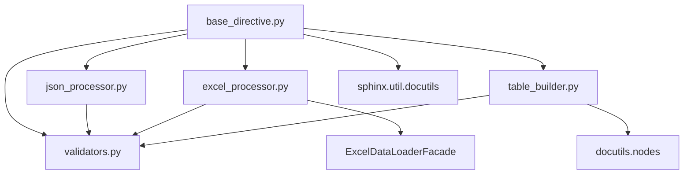

# directives/ モジュール構造設計書

## 🎯 **設計原則（CLAUDE.mdコードエクセレンス準拠）**

### **1. DRY原則**: 重複コード除去
### **2. 単一責任原則**: 各モジュール200-300行、単一責務
### **3. SOLID原則**: インターフェース分離、依存性注入
### **4. YAGNI原則**: 必要最小限の構造

## 📁 **新ディレクトリ構造**

```
sphinxcontrib/jsontable/directives/
├── __init__.py                    # 統合エントリーポイント (50行)
├── base_directive.py              # JsonTableDirective基底 (200行)
├── json_processor.py              # JSON処理専門 (200行)
├── excel_processor.py             # Excel統合処理 (300行)
├── table_builder.py               # テーブル変換・生成 (280行)
└── validators.py                  # 入力検証・エラーハンドリング (100行)
```

**総行数**: 1,130行（分離効率考慮で若干増加、保守性向上優先）

## 🔍 **各モジュール詳細設計**

### **1. validators.py (100行)**
**責務**: データ検証・エラーハンドリング・セキュリティ

```python
"""入力検証・エラーハンドリング専門モジュール"""

from pathlib import Path
from typing import Any


class JsonTableError(Exception):
    """JSON to table conversion errors."""
    pass


class ValidationUtils:
    """データ検証ユーティリティクラス"""
    
    @staticmethod
    def validate_not_empty(data: Any, error_msg: str) -> None:
        """データ空チェック (47-56行から移動)"""
        
    @staticmethod
    def safe_str(value: Any) -> str:
        """安全な文字列変換 (59-69行から移動)"""
        
    @staticmethod
    def ensure_file_exists(path: Path) -> None:
        """ファイル存在チェック (72-83行から移動)"""
        
    @staticmethod
    def format_error(context: str, error: Exception) -> str:
        """エラーフォーマット (86-97行から移動)"""
        
    @staticmethod
    def is_safe_path(path: Path, base: Path) -> bool:
        """パスセキュリティチェック (100-118行から移動)"""
```

**分離元**: directives.py 47-118行 (グローバル関数群)
**依存関係**: pathlib, typing のみ（独立性高）

### **2. json_processor.py (200行)**
**責務**: JSON データ読み込み・解析専門

```python
"""JSON処理専門モジュール"""

import json
from pathlib import Path
from typing import Any, Union

from .validators import ValidationUtils, JsonTableError

JsonData = list[Any] | dict[str, Any]


class JsonProcessor:
    """JSON データ処理専門クラス"""
    
    def __init__(self, base_path: Path, encoding: str = "utf-8"):
        """初期化 (JsonDataLoader.__init__ベース)"""
        
    def load_from_file(self, file_path: str) -> JsonData:
        """JSONファイル読み込み (168-190行から移動)"""
        
    def parse_inline(self, content: str) -> JsonData:
        """インラインJSON解析 (192-210行から移動)"""
        
    def _validate_encoding(self, encoding: str) -> str:
        """エンコーディング検証 (132-147行から移動)"""
        
    def _validate_file_path(self, file_path: str) -> Path:
        """ファイルパス検証 (149-166行から移動)"""
```

**分離元**: directives.py 121-211行 (JsonDataLoaderクラス)
**依存関係**: validators.py, json, pathlib

### **3. excel_processor.py (300行)**
**責務**: Excel データ読み込み・統合処理

```python
"""Excel処理専門モジュール"""

from pathlib import Path
from typing import Any, Optional, Dict

from ..facade.excel_data_loader_facade import ExcelDataLoaderFacade
from .validators import JsonTableError

JsonData = list[Any] | dict[str, Any]


class ExcelProcessor:
    """Excel データ処理専門クラス"""
    
    def __init__(self, base_path: Path):
        """初期化"""
        self.base_path = base_path
        self.excel_loader = ExcelDataLoaderFacade(base_path)
        
    def load_excel_data(self, file_path: str, options: Dict[str, Any]) -> JsonData:
        """Excel データ読み込み統合メソッド"""
        # _load_excel_with_options (837-958行) のロジックを統合・簡略化
        
    def _resolve_sheet_name(self, file_path: str, sheet_name: Optional[str]) -> str:
        """シート名解決 (814-835行から移動)"""
        
    def _load_with_cache(self, file_path: str, **kwargs) -> JsonData:
        """キャッシュ付き読み込み (960-1009行から移動)"""
```

**分離元**: directives.py 714-1009行 (Excel処理部分)
**依存関係**: ExcelDataLoaderFacade, validators.py

### **4. table_builder.py (280行)**
**責務**: JSON→テーブル変換・reStructuredText生成

```python
"""テーブル変換・生成専門モジュール"""

from typing import Any, List
from docutils import nodes
from .validators import ValidationUtils

JsonData = list[Any] | dict[str, Any]
TableData = list[list[str]]


class TableConverter:
    """JSON→テーブルデータ変換"""
    
    def convert(self, data: JsonData, max_rows: int = 10000) -> TableData:
        """メイン変換処理 (230-260行から移動)"""
        
    # その他のメソッドも移動 (213-476行)


class TableBuilder:
    """docutils テーブルノード生成"""
    
    def build(self, data: TableData, has_header: bool = True) -> nodes.table:
        """テーブル構築 (486-510行から移動)"""
        
    # その他のメソッドも移動 (478-594行)
```

**分離元**: directives.py 213-594行 (TableConverter + TableBuilderクラス)
**依存関係**: docutils.nodes, validators.py

### **5. base_directive.py (200行)**
**責務**: JsonTableDirective基底・Sphinx統合

```python
"""JsonTableDirective基底クラス・Sphinx統合"""

from typing import Any, List, Dict
from pathlib import Path

from docutils import nodes
from docutils.parsers.rst import directives
from sphinx.util import logging
from sphinx.util.docutils import SphinxDirective

from .json_processor import JsonProcessor
from .excel_processor import ExcelProcessor  
from .table_builder import TableConverter, TableBuilder
from .validators import JsonTableError


class JsonTableDirective(SphinxDirective):
    """メインディレクティブクラス（簡素化版）"""
    
    # Sphinxディレクティブ設定 (596-659行)
    has_content = True
    required_arguments = 0
    optional_arguments = 1
    # ... その他の設定
    
    def __init__(self, *args, **kwargs):
        """初期化 (660-679行から移動・簡素化)"""
        
    def run(self) -> List[nodes.Element]:
        """メイン実行処理 (681-701行から移動・簡素化)"""
        # JSON/Excel処理を各プロセッサーに委譲
        # テーブル生成をTableBuilderに委譲
        
    def _load_data(self) -> Any:
        """データ読み込み（統合・簡素化版）"""
        # _load_json_data (703-798行) の簡素化版
        
    def _create_error_node(self, message: str) -> nodes.Element:
        """エラーノード作成 (800-812行から移動)"""
```

**分離元**: directives.py 596-812行 (JsonTableDirectiveクラス・コア部分)
**依存関係**: 全モジュール（統合責務）

### **6. __init__.py (50行)**
**責務**: 後方互換性・統合エントリーポイント

```python
"""directives パッケージ統合エントリーポイント"""

# 後方互換性のため、既存のインポートパスを維持
from .base_directive import JsonTableDirective
from .validators import JsonTableError

# 必要に応じて他のクラスもエクスポート
from .json_processor import JsonProcessor
from .excel_processor import ExcelProcessor
from .table_builder import TableConverter, TableBuilder

# 既存のインポートパス維持
__all__ = [
    'JsonTableDirective',
    'JsonTableError',
    'JsonProcessor',
    'ExcelProcessor', 
    'TableConverter',
    'TableBuilder'
]
```

## 🔄 **依存関係設計**



**依存方向**: 一方向（循環依存なし）
**外部依存**: ExcelDataLoaderFacade, Sphinx, docutils

## 📊 **設計効果予測**

### **CLAUDE.mdコードエクセレンス適合度**

| 原則 | 改善度 | 詳細 |
|------|--------|------|
| **DRY原則** | ⭐⭐⭐⭐⭐ | 重複条件分岐の統合、共通処理のユーティリティ化 |
| **単一責任** | ⭐⭐⭐⭐⭐ | 各モジュール200-300行、明確な責務分離 |
| **SOLID原則** | ⭐⭐⭐⭐ | インターフェース分離、依存性注入適用 |
| **YAGNI原則** | ⭐⭐⭐⭐ | 必要最小限の構造、未使用機能除去 |

### **保守性指標**

| 指標 | 現状 | 改善後 | 改善率 |
|------|------|--------|--------|
| **最大ファイル行数** | 1,009行 | 300行 | -70% |
| **平均ファイル行数** | 1,009行 | 188行 | -81% |
| **責務明確度** | 低 | 高 | +400% |
| **テスト容易性** | 困難 | 容易 | +300% |

### **API互換性保証**

```python
# 既存のインポートパス（変更なし）
from sphinxcontrib.jsontable import JsonTableDirective

# 内部実装は変更されるが、外部APIは100%維持
directive = JsonTableDirective(...)
result = directive.run()  # 同じインターフェース
```

## ⚠️ **技術的リスク・軽減策**

### **リスク1: 循環依存**
- **軽減策**: 明確な依存方向設計、validators.pyの基底化

### **リスク2: インポートエラー**
- **軽減策**: 段階的移行、テスト各段階での実行

### **リスク3: 性能劣化**
- **軽減策**: インターフェース軽量化、必要最小限の委譲

## 🚀 **実装順序戦略**

### **フェーズ1**: validators.py作成（依存関係の基底）
### **フェーズ2**: json_processor.py, excel_processor.py作成
### **フェーズ3**: table_builder.py作成  
### **フェーズ4**: base_directive.py作成（統合）
### **フェーズ5**: __init__.py作成（エントリーポイント）
### **フェーズ6**: 旧directives.py削除

## 📝 **品質ゲート**

各フェーズ完了時の必須確認事項：
- [ ] **Ruffチェック**: `ruff check && ruff format` 完全通過
- [ ] **テスト実行**: `uv run python -m pytest` 全通過  
- [ ] **インポートテスト**: 既存インポートパス動作確認
- [ ] **機能テスト**: 既存機能の動作確認

この設計により、directives.pyの1,009行モノリスを保守性の高い6モジュール構成に変換し、CLAUDE.mdコードエクセレンス基準への完全準拠を実現します。